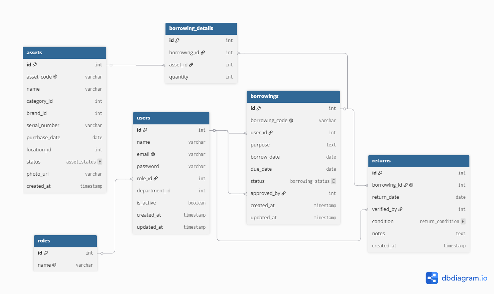
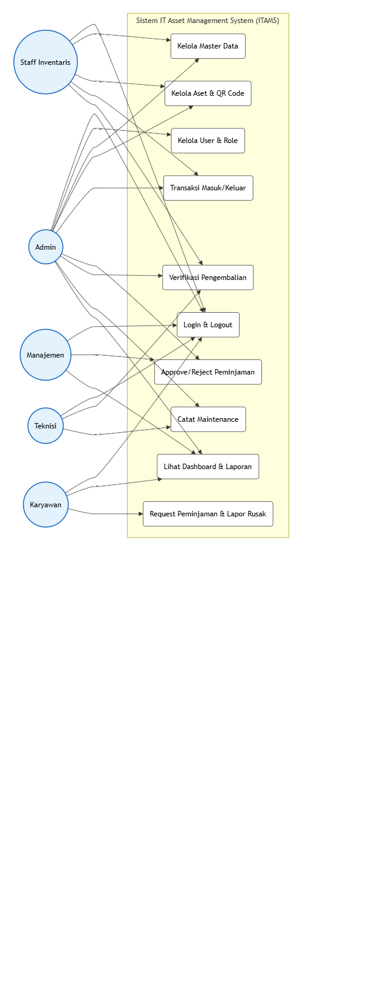
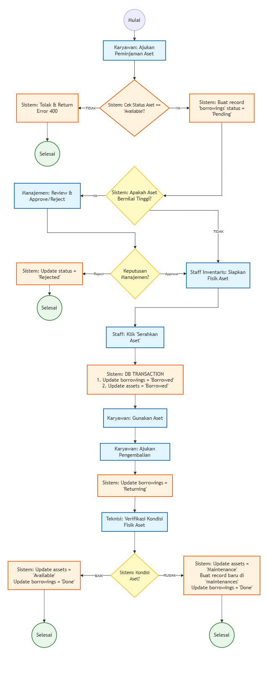

## 4.2 Perancangan Database & UML

Bagian ini merincikan rancangan visual sistem, meliputi Entity Relationship Diagram (ERD) untuk struktur database, serta Use Case dan Activity Diagram untuk memetakan hak akses dan alur bisnis sistem.

### 4.2.1 Entity Relationship Diagram (ERD)
Diagram di bawah ini menunjukkan relasi antar tabel database yang telah dinormalisasi (3NF) untuk mendukung seluruh modul ITAMS.


*Gambar 4.2.1 - Entity Relationship Diagram (ERD) ITAMS*

### 4.2.2 Use Case Diagram
Diagram ini memetakan hak akses setiap role (Admin, Manajemen, Staff, Teknisi, Karyawan) terhadap fitur-fitur sistem (Use Case).


*Gambar 4.2.2 - Use Case Diagram ITAMS*

### 4.2.3 Activity Diagram (Alur Peminjaman & Pengembalian)
Diagram ini menjelaskan alur logika bisnis dari pengajuan peminjaman, persetujuan, serah terima, hingga verifikasi pengembalian oleh teknisi.


*Gambar 4.2.3 - Activity Diagram Alur Peminjaman & Pengembalian Aset*

---

## 4.3 API Contract & Endpoint Design

Berikut adalah daftar endpoint RESTful API yang akan diimplementasikan. Dokumentasi ini menjadi kontrak kerja antara Backend dan Frontend. Format response API akan selalu konsisten: `{ "success": boolean, "message": string, "data": any }`.

> **Catatan:** Tabel di bawah ini adalah draft kontrak API. Implementasi detail (termasuk skema JSON lengkap) akan didokumentasikan secara interaktif menggunakan **Swagger/OpenAPI** pada Tahap Development.

### Modul 1: Authentication & JWT
| Method | Endpoint | Deskripsi | Role | Request (Body/Query) | Response (Data) | Status Code |
|--------|----------|-----------|------|----------------------|-----------------|-------------|
| POST | `/api/v1/auth/login` | Login pengguna | Public | `{ email, password }` | `{ accessToken, refreshToken, user }` | 200, 401 |
| POST | `/api/v1/auth/logout` | Logout & invalidate token | All | `{ refreshToken }` | `{ message: "Logout berhasil" }` | 200, 401 |
| POST | `/api/v1/auth/refresh` | Mendapatkan Access Token baru | All | `{ refreshToken }` | `{ accessToken }` | 200, 401 |
| GET | `/api/v1/auth/me` | Mendapatkan profil user yang login | All | - | `{ user: { id, name, email, role } }` | 200, 401 |

### Modul 2: User & Role Management
| Method | Endpoint | Deskripsi | Role | Request (Body/Query) | Response (Data) | Status Code |
|--------|----------|-----------|------|----------------------|-----------------|-------------|
| GET | `/api/v1/users` | List semua pengguna | Admin | Query: `?page=1&role=Staff` | `{ users: [...], pagination: {...} }` | 200, 403 |
| POST | `/api/v1/users` | Tambah pengguna baru | Admin | `{ name, email, password, role_id, department_id }` | `{ user: {...} }` | 201, 400, 403 |
| PUT | `/api/v1/users/:id` | Update data pengguna | Admin | `{ name, role_id, is_active }` | `{ user: {...} }` | 200, 404, 403 |
| DELETE | `/api/v1/users/:id` | Soft delete pengguna | Admin | - | `{ message: "User dinonaktifkan" }` | 200, 404, 403 |

### Modul 3: Master Data (Category, Brand, Location, dll)
*(Contoh untuk Category, pola sama berlaku untuk Brand, Supplier, Location, Department)*
| Method | Endpoint | Deskripsi | Role | Request (Body/Query) | Response (Data) | Status Code |
|--------|----------|-----------|------|----------------------|-----------------|-------------|
| GET | `/api/v1/categories` | List kategori aset | All | Query: `?search=laptop` | `{ categories: [...] }` | 200, 403 |
| POST | `/api/v1/categories` | Tambah kategori baru | Admin, Staff | `{ name, description }` | `{ category: {...} }` | 201, 400, 403 |
| PUT | `/api/v1/categories/:id`| Update kategori | Admin, Staff | `{ name, description }` | `{ category: {...} }` | 200, 404, 403 |
| DELETE | `/api/v1/categories/:id`| Hapus kategori | Admin, Staff | - | `{ message: "Deleted" }` | 200, 400 (jika dipakai), 403 |

### Modul 4: Asset Management & QR Code
| Method | Endpoint | Deskripsi | Role | Request (Body/Query) | Response (Data) | Status Code |
|--------|----------|-----------|------|----------------------|-----------------|-------------|
| GET | `/api/v1/assets` | List semua aset | All | Query: `?page=1&status=Available&category_id=1` | `{ assets: [...], pagination }` | 200, 403 |
| GET | `/api/v1/assets/:id` | Detail 1 aset + riwayat | All | - | `{ asset: {...}, history: [...] }` | 200, 404, 403 |
| POST | `/api/v1/assets` | Tambah aset baru + foto | Staff | `multipart/form-data`: `{ name, category_id, photo, ... }` | `{ asset: {...}, qr_code_url }` | 201, 400, 403 |
| PUT | `/api/v1/assets/:id` | Update data aset | Admin, Staff | `{ name, location_id, status, ... }` | `{ asset: {...} }` | 200, 404, 403 |
| GET | `/api/v1/assets/:id/qrcode`| Download gambar QR Code | All | - | `Image/File` | 200, 404 |

### Modul 5: Transaksi Barang Masuk & Keluar
| Method | Endpoint | Deskripsi | Role | Request (Body/Query) | Response (Data) | Status Code |
|--------|----------|-----------|------|----------------------|-----------------|-------------|
| POST | `/api/v1/transactions/in` | Catat barang masuk | Staff | `{ invoice_no, supplier_id, date, items: [{asset_data}] }` | `{ transaction: {...} }` | 201, 400, 403 |
| POST | `/api/v1/transactions/out`| Catat barang keluar | Staff | `{ reason, date, asset_ids: [], pic_name }` | `{ transaction: {...} }` | 201, 400, 403 |
| GET | `/api/v1/transactions` | Riwayat transaksi | Admin, Staff, Manajemen | Query: `?type=in&start_date=2026-01-01` | `{ transactions: [...] }` | 200, 403 |

### Modul 6: Peminjaman & Pengembalian Aset
| Method | Endpoint | Deskripsi | Role | Request (Body/Query) | Response (Data) | Status Code |
|--------|----------|-----------|------|----------------------|-----------------|-------------|
| POST | `/api/v1/borrowings` | Request peminjaman | Karyawan | `{ asset_ids: [], purpose, due_date }` | `{ borrowing: {...} }` | 201, 400, 403 |
| GET | `/api/v1/borrowings` | List request peminjaman | Staff, Admin, Manajemen | Query: `?status=Pending` | `{ borrowings: [...] }` | 200, 403 |
| PATCH| `/api/v1/borrowings/:id/approve`| Approve/Reject request | Manajemen, Staff | `{ status: "Approved" / "Rejected", notes }` | `{ borrowing: {...} }` | 200, 400, 403 |
| PATCH| `/api/v1/borrowings/:id/handover`| Serah terima fisik | Staff | - | `{ borrowing: {...} }` | 200, 400, 403 |
| POST | `/api/v1/borrowings/:id/return` | Ajukan pengembalian | Karyawan | - | `{ borrowing: {...} }` | 200, 400, 403 |
| PATCH| `/api/v1/borrowings/:id/verify` | Verifikasi kondisi oleh Teknisi| Teknisi | `{ condition: "Baik"/"Rusak", notes }` | `{ borrowing: {...}, asset_status }`| 200, 400, 403 |

### Modul 7: Maintenance Tracking
| Method | Endpoint | Deskripsi | Role | Request (Body/Query) | Response (Data) | Status Code |
|--------|----------|-----------|------|----------------------|-----------------|-------------|
| POST | `/api/v1/maintenance` | Lapor kerusakan aset | Karyawan, Teknisi | `{ asset_id, description, photo (opt) }` | `{ maintenance: {...} }` | 201, 400, 403 |
| PUT | `/api/v1/maintenance/:id` | Update status perbaikan | Teknisi | `{ status: "In Progress"/"Completed", cost, notes }` | `{ maintenance: {...} }` | 200, 404, 403 |
| GET | `/api/v1/maintenance` | Riwayat maintenance | Teknisi, Staff, Manajemen| Query: `?asset_id=5` | `{ maintenances: [...] }` | 200, 403 |

### Modul 8: Dashboard & Statistik
| Method | Endpoint | Deskripsi | Role | Request (Body/Query) | Response (Data) | Status Code |
|--------|----------|-----------|------|----------------------|-----------------|-------------|
| GET | `/api/v1/dashboard/executive` | Statistik untuk Manajemen | Manajemen | Query: `?period=month` | `{ total_assets, by_category: [], by_location: [] }` | 200, 403 |
| GET | `/api/v1/dashboard/operational`| Statistik untuk Staff | Staff | - | `{ available_count, borrowed_count, pending_requests }` | 200, 403 |
| GET | `/api/v1/dashboard/personal` | Statistik untuk Karyawan | Karyawan | - | `{ my_active_borrowings: [], overdue_count }` | 200, 403 |

### Modul 9: Report & Document Export
| Method | Endpoint | Deskripsi | Role | Request (Body/Query) | Response (Data) | Status Code |
|--------|----------|-----------|------|----------------------|-----------------|-------------|
| GET | `/api/v1/reports/assets/pdf` | Export daftar aset ke PDF | Admin, Staff, Manajemen | Query: `?category_id=1` | `File (application/pdf)` | 200, 403 |
| GET | `/api/v1/reports/assets/excel`| Export daftar aset ke Excel | Admin, Staff, Manajemen | Query: `?category_id=1` | `File (application/vnd.openxmlformats...)`| 200, 403 |
| GET | `/api/v1/reports/borrowings/pdf`| Export laporan peminjaman | Admin, Staff, Manajemen | Query: `?start_date=...&end_date=...` | `File (application/pdf)` | 200, 403 |

---

## 4.4 Struktur Folder & Arsitektur Kode

Sistem ini menggunakan arsitektur Monorepo (satu repository untuk Backend dan Frontend) dengan pemisahan tanggung jawab yang jelas. Berikut adalah rancangan struktur folder dan penamaan file yang akan diterapkan sesuai standar proyek:

### 4.4.1 Struktur Folder Backend (Express.js)
Backend menggunakan pola arsitektur **MVC (Model-View-Controller) + Service/Middleware Layer** untuk memisahkan logika bisnis, routing, dan akses database.

```
itams-makerindo/
├── backend/
│   ├── src/
│   │   ├── config/         # Konfigurasi database, JWT, Swagger
│   │   │   ── database.js
│   │   ├── controllers/    # Menerima request, validasi, kirim response
│   │   │   ├── authController.js
│   │   │   ├── assetController.js
│   │   │   └── borrowingController.js
│   │   ├── models/         # Representasi tabel database (Sequelize/MySQL)
│   │   │   ├── User.js
│   │   │   ├── Asset.js
│   │   │   └── Borrowing.js
│   │   ├── routes/         # Definisi URL endpoint API
│   │   │   ├── authRoutes.js
│   │   │   └── assetRoutes.js
│   │   ├── middlewares/    # Fungsi perantara (Auth JWT, RBAC Role, Error Handler)
│   │   │   ├── authMiddleware.js
│   │   │   └── rbacMiddleware.js
│   │   ├── utils/          # Fungsi helper (Generate QR, Format Tanggal, Response JSON)
│   │   │   └── qrGenerator.js
│   │   └── app.js          # Entry point utama aplikasi Express
│   ├── .env.example        # Template environment variable
│   └── package.json        # Daftar library dependencies
```
### 4.4.2 Struktur Folder Frontend (React + Vite)
Frontend dibangun sebagai Single Page Application (SPA). Logika pemanggilan API dipisahkan ke dalam folder services/ agar komponen UI tetap bersih dan rapi.
```
── frontend/
│   ├── public/             # File statis (Logo, Favicon)
│   ├── src/
│   │   ├── assets/         # Gambar, CSS global, Font
│   │   ├── components/     # Komponen UI yang bisa dipakai ulang (Button, Table, Modal)
│   │   │   ├── Navbar.jsx
│   │   │   ── AssetTable.jsx
│   │   ├── pages/          # Halaman utama aplikasi (satu file = satu halaman)
│   │   │   ├── LoginPage.jsx
│   │   │   ├── DashboardPage.jsx
│   │   │   └── AssetPage.jsx
│   │   ├── layouts/        # Layout wrapper (Sidebar + Header)
│   │   │   └── MainLayout.jsx
│   │   ├── services/       # Kumpulan fungsi Axios untuk panggil API Backend
│   │   │   ├── authService.js
│   │   │   └── assetService.js
│   │   ├── context/        # Global state (AuthContext, RoleContext)
│   │   │   └── AuthContext.jsx
│   │   ├── routes/         # Konfigurasi React Router & Proteksi Route
│   │   │   └── AppRoutes.jsx
│   │   ├── App.jsx         # Komponen utama React
│   │   └── main.jsx        # Entry point rendering React
│   ├── index.html
│   ├── .env.example
│   └── package.json
```