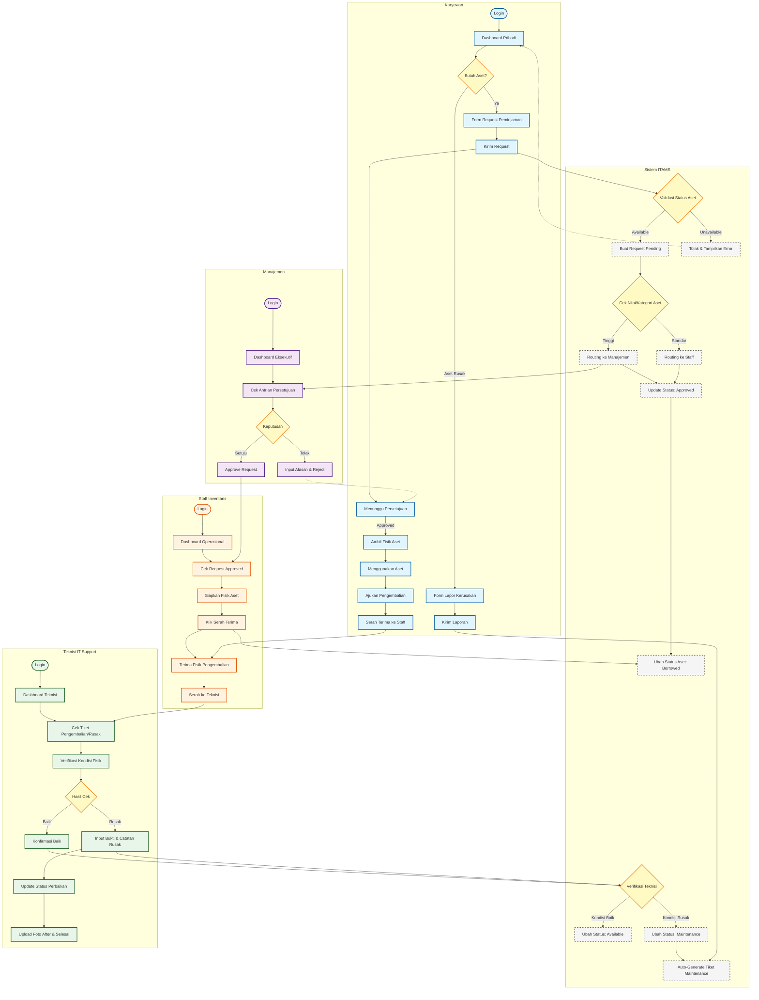

# UI/UX Design & User Flow
**Proyek:** IT Asset Management System (ITAMS)  
**Perusahaan:** PT. Makerindo Prima Solusi  
**Versi Dokumen:** 1.0  
**Tanggal:** 17 Juli 2026  
**Dibuat untuk:** Wulan Sugiarti (Frontend Developer)  
**Disetujui oleh:** Kak Daffa (Pembimbing)

---

## 📋 Daftar Isi
1. [Metodologi Desain](#1-metodologi-desain)
2. [Wireframe Prompts - Google Stitch](#2-wireframe-prompts---google-stitch)
3. [User Flow Diagram](#3-user-flow-diagram)
4. [User Flow Detail Per Role](#4-user-flow-detail-per-role)
5. [Link Desain](#5-link-desain)

---

## 1. Metodologi Desain

### 1.1 Tools yang Digunakan
- **Google Stitch** - AI design tool untuk generate wireframe awal dari text prompt.
- **Figma** (Opsional) - Untuk refinement dan finalisasi desain UI/UX.
- **Mermaid.js** - Untuk membuat diagram user flow.

### 1.2 Pendekatan Desain
- **Role-Based Design**: Setiap role memiliki halaman dan alur yang spesifik.
- **Mobile-First**: Desain responsif untuk desktop, tablet, dan mobile.
- **Consistency**: Menggunakan Bootstrap 5 untuk konsistensi komponen UI.
- **No Financial Data**: Fokus pada kuantitas dan status aset (tanpa kolom harga/nilai).

### 1.3 Prinsip Prompt Engineering
- **1 Prompt = 1 Halaman Spesifik** (tidak digabung).
- **100% Bahasa Indonesia** untuk semua teks UI.
- **Pemisahan Tabel dan Form** (untuk hasil yang lebih detail).

---

## 2. Wireframe Prompts - Google Stitch

### 2.1 Role: Karyawan (Employee)

#### **Halaman 1: Dashboard Pribadi**
```text
Wireframe high-fidelity halaman "Dashboard Pribadi" untuk role Karyawan. Gunakan bahasa Indonesia untuk semua teks UI. Desain modern, bersih, profesional.

PENTING: Ini halaman DASHBOARD saja, JANGAN masukkan form peminjaman atau laporan kerusakan.

LAYOUT:
- Sidebar kiri dengan 4 menu: "Dashboard Saya" (AKTIF/HIGHLIGHTED biru), "Ajukan Peminjaman", "Lapor Kerusakan", "Riwayat Saya"
- Header atas: Logo "ITAMS", breadcrumb "Beranda / Dashboard", dropdown profil "Budi Santoso - Karyawan" dengan foto avatar
- KONTEN UTAMA:
  * Judul halaman: "Dashboard Pribadi Saya"
  * 3 Kartu ringkasan di baris atas (horizontal):
    - Kartu 1: Icon laptop, angka besar "2", label "Sedang Dipinjam"
    - Kartu 2: Icon jam, angka "1", label "Permintaan Pending"  
    - Kartu 3: Icon warning merah, angka "0", label "Terlambat Pengembalian" (warna merah jika > 0)
  * Tabel "Aset yang Sedang Saya Pinjam" dengan kolom:
    - Nama Aset (contoh: "MacBook Pro 16", "Dell XPS 15")
    - Tanggal Pinjam (contoh: "10 Okt 2023")
    - Tanggal Jatuh Tempo (contoh: "26 Okt 2023" - highlight merah jika lewat)
    - Status (badge biru "Dipinjam")
    - Tombol aksi: "Ajukan Pengembalian" (biru)
  * Widget "Notifikasi" di bawah: "Pengembalian MacBook Pro jatuh tempo dalam 3 hari"
- Style: Background putih, aksen biru #0d6efd, kartu dengan shadow halus, Bootstrap 5 style
```

#### **Halaman 2: Form Ajukan Peminjaman**
```text
Wireframe high-fidelity halaman "Form Ajukan Peminjaman" untuk role Karyawan. Gunakan bahasa Indonesia untuk semua teks.

PENTING: Ini halaman FORM KHUSUS, jangan tampilkan dashboard atau tabel. Fokus pada form pengajuan.

LAYOUT:
- Sidebar kiri: "Dashboard Saya", "Ajukan Peminjaman" (AKTIF/HIGHLIGHTED), "Lapor Kerusakan", "Riwayat Saya"
- Header atas: Breadcrumb "Beranda / Ajukan Peminjaman"
- KONTEN UTAMA:
  * Judul: "Form Permintaan Peminjaman Aset"
  * Form tunggal yang rapi dengan sections:
    Section 1 - "Pilihan Aset":
    - Dropdown searchable: "Pilih Aset" (placeholder: "Cari atau pilih aset...")
    - Kartu preview detail aset (muncul setelah pilih): Kode: AST-2026-0015, Nama: MacBook Pro 16", Kategori: Laptop, Status: Badge hijau "Tersedia"
    
    Section 2 - "Detail Peminjaman":
    - Textarea: "Tujuan Peminjaman" (required)
    - Date picker: "Tanggal Pinjam" (default hari ini)
    - Date picker: "Tanggal Rencana Kembali" (required)
    - Dropdown: "Durasi" (pilihan: 1 minggu, 2 minggu, 1 bulan, Custom)
    
    Section 3 - "Informasi Tambahan":
    - Textarea: "Catatan" (optional)
    - File upload: "Dokumen Pendukung" (optional, max 2MB)
  
  * Box info dengan icon: "Permintaan Anda akan ditinjau oleh Staff Inventaris dan disetujui Manajemen jika diperlukan."
  * Tombol di bawah: Tombol primer biru besar "Kirim Permintaan", Tombol sekunder abu-abu "Batal"
- Style: Form yang clean, label jelas, required field ditandai merah, Bootstrap 5 components
```

#### **Halaman 3: Form Lapor Kerusakan**
```text
Wireframe high-fidelity halaman "Lapor Kerusakan" untuk role Karyawan. Gunakan bahasa Indonesia.

PENTING: Halaman khusus untuk report damage, jangan campur dengan fitur lain.

LAYOUT:
- Sidebar kiri: "Dashboard Saya", "Ajukan Peminjaman", "Lapor Kerusakan" (AKTIF), "Riwayat Saya"
- Header atas: Breadcrumb "Beranda / Lapor Kerusakan"
- KONTEN UTAMA:
  * Alert banner oranye di atas: "Laporkan kerusakan atau kehilangan aset segera untuk resolusi cepat."
  * Judul: "Form Laporan Kerusakan Aset"
  * Form dengan sections:
    Section 1 - "Informasi Aset": Dropdown "Pilih Aset yang Dipinjam" (hanya tampilkan aset yang sedang dipinjam user)
    Section 2 - "Detail Kerusakan": Radio buttons "Jenis Kerusakan" (Fisik, Fungsional, Hilang, Lainnya), Textarea "Deskripsi" (required), Date picker "Tanggal Kejadian", Dropdown "Tingkat Keparahan" (Minor, Sedang, Berat)
    Section 3 - "Bukti": Area upload foto "Upload Foto Kerusakan" (drag & drop, max 5 foto), Textarea "Catatan Tambahan"
  * Box info: "Tim teknis akan memverifikasi dan menghubungi Anda dalam 1x24 jam."
  * Tombol: Tombol primer oranye/merah "Kirim Laporan", Tombol sekunder "Batal"
- Style: Clean form, photo upload preview area, Bootstrap 5, white background
```

#### **Halaman 4: Riwayat Peminjaman**
```text
Wireframe high-fidelity halaman "Riwayat" untuk role Karyawan. Gunakan bahasa Indonesia.

PENTING: Halaman untuk melihat history, bukan form atau dashboard.

LAYOUT:
- Sidebar kiri: "Dashboard Saya", "Ajukan Peminjaman", "Lapor Kerusakan", "Riwayat Saya" (AKTIF)
- Header atas: Breadcrumb "Beranda / Riwayat"
- KONTEN UTAMA:
  * Judul: "Riwayat Peminjaman Saya"
  * Tab navigation di atas: Tab 1 "Riwayat Peminjaman" (AKTIF), Tab 2 "Laporan Kerusakan"
  * Konten Tab 1: Filter bar (Search, Dropdown Status, Date range), Tabel data (Nama Aset, Tgl Pinjam, Tgl Kembali, Durasi, Status badge, Tombol "Lihat Detail"), Pagination.
  * Konten Tab 2: Tabel (Nama Aset, Tgl Lapor, Jenis Kerusakan, Status, Tombol "Lihat Detail")
- Style: Tabel clean, status badges berwarna, Bootstrap 5 table styling
```

---

### 2.2 Role: Manajemen (Management)

#### **Halaman 1: Dashboard Eksekutif**
```text
Wireframe high-fidelity halaman "Dashboard Eksekutif" untuk role Manajemen. Gunakan bahasa Indonesia untuk semua teks UI. Desain profesional, clean, dan berfokus pada visualisasi data.

PENTING: JANGAN tampilkan nilai uang, harga, atau biaya. Fokus pada JUMLAH UNIT. Ini halaman DASHBOARD saja.

LAYOUT:
- Sidebar kiri dengan 4 menu: "Dashboard Eksekutif" (AKTIF), "Data Aset (Read-Only)", "Antrian Persetujuan", "Laporan & Ekspor"
- Header atas: Logo "ITAMS", breadcrumb, dropdown filter periode "Bulan Ini", profil "Direktur Operasional"
- KONTEN UTAMA:
  * Judul: "Dashboard Eksekutif - Ringkasan Aset IT"
  * Baris 1 - 4 Kartu metrik: "Total Unit Aset" (156), "Aset Aktif" (142), "Kategori Aset" (8), "Persetujuan Pending" (3)
  * Baris 2 - 2 Grafik: Pie chart "Distribusi Aset per Kategori", Bar chart "Jumlah Aset per Lokasi"
  * Baris 3 - Line chart "Tren Peminjaman Aset (6 Bulan Terakhir)"
  * Tombol aksi di kanan atas: "Ekspor ke PDF" (merah) dan "Ekspor ke Excel" (hijau)
- Style: Profesional, data-visualization focused, minimalis, tanpa simbol mata uang
```

#### **Halaman 2: Data Aset (Read-Only)**
```text
Wireframe high-fidelity halaman "Data Aset (Read-Only)" untuk role Manajemen. Gunakan bahasa Indonesia.

PENTING: JANGAN ada tombol "Tambah", "Edit", atau "Hapus". Role Manajemen hanya Read-Only.

LAYOUT:
- Sidebar kiri: "Dashboard Eksekutif", "Data Aset (Read-Only)" (AKTIF), "Antrian Persetujuan", "Laporan & Ekspor"
- Header atas: Breadcrumb, profil "Direktur Operasional"
- KONTEN UTAMA:
  * Judul: "Daftar Aset IT Perusahaan"
  * Baris Filter: Input pencarian, Dropdown Kategori, Dropdown Lokasi, Dropdown Status, Tombol "Ekspor Excel" & "Ekspor PDF"
  * Tabel Data: Kode Aset, Nama Aset, Kategori, Brand, Lokasi, Status (Badge warna), Aksi (Hanya tombol "Lihat Detail")
  * Pagination di bawah tabel.
- Style: Tabel data rapi, status badges jelas, tanpa elemen finansial.
```

#### **Halaman 3: Antrian Persetujuan**
```text
Wireframe high-fidelity halaman "Antrian Persetujuan" untuk role Manajemen. Gunakan bahasa Indonesia.

PENTING: Fokus pada persetujuan peminjaman. JANGAN tampilkan nilai uang.

LAYOUT:
- Sidebar kiri: "Dashboard Eksekutif", "Data Aset (Read-Only)", "Antrian Persetujuan" (AKTIF), "Laporan & Ekspor"
- KONTEN UTAMA:
  * Judul: "Antrian Persetujuan Permintaan Aset"
  * Baris Atas - 3 Kartu Ringkasan: "Menunggu Persetujuan", "Disetujui Bulan Ini", "Ditolak Bulan Ini"
  * Tabel Data: ID Request, Tgl Request, Nama Pemohon & Dept, Nama Aset & Jumlah, Tujuan, Status, Aksi (Tombol "Setuju" hijau, "Tolak" merah)
  * Modal Preview "Form Tolak Request": Textarea "Alasan Penolakan", Tombol "Konfirmasi Penolakan"
- Style: Tabel jelas, warna hijau untuk setuju, merah untuk tolak.
```

#### **Halaman 4: Laporan & Ekspor**
```text
Wireframe high-fidelity halaman "Laporan & Ekspor" untuk role Manajemen. Gunakan bahasa Indonesia.

LAYOUT:
- Sidebar kiri: "Dashboard Eksekutif", "Data Aset (Read-Only)", "Antrian Persetujuan", "Laporan & Ekspor" (AKTIF)
- KONTEN UTAMA:
  * Judul: "Pusat Laporan & Ekspor Data"
  * Bagian 1: Pilihan Jenis Laporan (Card Grid 2x2: Daftar Aset, Peminjaman, Barang Masuk/Keluar, Maintenance)
  * Bagian 2: Panel Filter (Date Range, Dropdown Departemen, Dropdown Status)
  * Bagian 3: Tombol Aksi Ekspor Besar ("Ekspor ke PDF", "Ekspor ke Excel")
  * Bagian 4: Tabel Riwayat Ekspor Terakhir
- Style: Layout kartu rapi, panel filter terstruktur.
```

---

### 2.3 Role: Staff Inventaris

#### **Halaman 1: Dashboard Operasional**
```text
Wireframe high-fidelity halaman "Dashboard Operasional" untuk role Staff Inventaris. Gunakan bahasa Indonesia.

LAYOUT:
- Sidebar kiri (6 Menu): "Dashboard Operasional" (AKTIF), "Manajemen Aset", "Transaksi Masuk/Keluar", "Permintaan Peminjaman", "Data Master", "Manajer QR Code"
- KONTEN UTAMA:
  * Judul: "Dashboard Operasional Inventaris"
  * Baris 1 - 4 Kartu Metrik: "Aset Tersedia", "Sedang Dipinjam", "Dalam Maintenance", "Request Pending"
  * Baris 2 - 2 Widget: "Aset Segera Jatuh Tempo", "Aset Garansi Segera Habis"
  * Baris 3 - Tombol Quick Actions: "+ Tambah Aset Baru", "Proses Barang Masuk"
- Style: Fungsional, padat informasi, badge status jelas.
```

#### **Halaman 2: Daftar Aset**
```text
Wireframe high-fidelity halaman "Daftar Aset" untuk role Staff Inventaris. Gunakan bahasa Indonesia.

PENTING: Ini halaman TABEL DAFTAR, JANGAN tampilkan form input besar.

LAYOUT:
- Sidebar kiri: "Dashboard Operasional", "Manajemen Aset" (AKTIF), "Transaksi", "Peminjaman", "Data Master", "QR Code"
- Header atas: Tombol "+ Tambah Aset Baru" (biru)
- KONTEN UTAMA:
  * Judul: "Daftar Seluruh Aset IT"
  * Baris Filter: Search, Dropdown Kategori, Lokasi, Status
  * Tabel Data: Kode Aset, Nama & Foto Thumbnail, Kategori & Brand, Lokasi, Status (Badge warna), Aksi (Icon: Lihat, Edit, Cetak QR, Hapus)
  * Pagination
- Style: Tabel Bootstrap 5 rapi, tanpa elemen finansial.
```

#### **Halaman 3: Form Tambah Aset**
```text
Wireframe high-fidelity halaman "Form Tambah Aset Baru" untuk role Staff Inventaris. Gunakan bahasa Indonesia.

PENTING: Ini halaman FORM KHUSUS, JANGAN tampilkan tabel daftar.

LAYOUT:
- Sidebar kiri: "Manajemen Aset" (AKTIF)
- KONTEN UTAMA:
  * Judul: "Tambah Aset Baru ke Inventaris", Tombol "Kembali"
  * Kartu 1 "Informasi Dasar": Kode Aset (Auto), Nama, Kategori, Brand, Model, Serial Number
  * Kartu 2 "Pembelian & Lokasi": Tgl Pembelian, Garansi, Supplier, Lokasi, Status Awal
  * Kartu 3 "Dokumen": Upload Foto (drag & drop), Preview Box QR Code
  * Tombol Aksi: "Simpan Aset" (biru), "Batal"
- Style: Form clean, label di atas input, required field ditandai (*).
```

#### **Halaman 4: Daftar Transaksi (Masuk & Keluar)**
```text
Wireframe high-fidelity halaman "Daftar Transaksi" untuk role Staff Inventaris. Gunakan bahasa Indonesia.

LAYOUT:
- Sidebar kiri: "Transaksi Masuk/Keluar" (AKTIF)
- KONTEN UTAMA:
  * Judul: "Riwayat Transaksi Barang Masuk & Keluar"
  * TAB NAVIGATION: "Barang Masuk" (AKTIF), "Barang Keluar"
  * Baris Aksi: Tombol "+ Catat Barang Masuk", "Catat Barang Keluar", Search, Date Range, Filter Supplier
  * TABEL Tab Masuk: No. Invoice, Tanggal, Supplier, Jumlah Unit, PIC, Status, Aksi (Lihat Detail)
  * TABEL Tab Keluar: No. Transaksi, Tanggal, Alasan (Badge warna), Jumlah Unit, PIC, Aksi
  * Pagination
- Style: Tabel rapi, tab navigation jelas.
```

#### **Halaman 5: Manajer QR Code**
```text
Wireframe high-fidelity halaman "Manajer QR Code" untuk role Staff Inventaris. Gunakan bahasa Indonesia.

LAYOUT:
- Sidebar kiri: "Manajer QR Code" (AKTIF)
- KONTEN UTAMA:
  * Judul: "Manajemen & Cetak QR Code Aset"
  * Baris Aksi: Tombol "Cetak Terpilih (Batch)", Search, Filter Status, Filter Lokasi
  * Tabel Data: Checkbox, Kode Aset, Nama & Kategori, Lokasi, Status, Preview QR (Thumbnail), Aksi (Cetak Satuan)
  * Pagination
- Style: Tabel dengan checkbox jelas, thumbnail QR proporsional.
```

---

### 2.4 Role: Teknisi (IT Support)

#### **Halaman 1: Dashboard Teknisi**
```text
Wireframe high-fidelity halaman "Dashboard Teknisi" untuk role Teknisi. Gunakan bahasa Indonesia.

LAYOUT:
- Sidebar kiri (3 Menu): "Dashboard Teknisi" (AKTIF), "Tracking Maintenance", "Verifikasi Pengembalian"
- KONTEN UTAMA:
  * Judul: "Dashboard Teknisi - Ringkasan Perbaikan"
  * Baris 1 - 3 Kartu: "Laporan Kerusakan Baru", "Sedang Diperbaiki", "Selesai Bulan Ini"
  * Baris 2 - Widget "Tugas Prioritas": Tabel mini (ID Tiket, Nama Aset, Pelapor, Deskripsi, Status, Tombol Update)
  * Baris 3 - Widget "Pengembalian Menunggu Verifikasi": Tabel mini (Nama Aset, Peminjam, Tgl Kembali, Tombol Verifikasi)
- Style: Padat informasi, badge status jelas.
```

#### **Halaman 2: Daftar Tracking Maintenance**
```text
Wireframe high-fidelity halaman "Daftar Tracking Maintenance" untuk role Teknisi. Gunakan bahasa Indonesia.

PENTING: Ini halaman TABEL DAFTAR, JANGAN tampilkan form update besar.

LAYOUT:
- Sidebar kiri: "Tracking Maintenance" (AKTIF)
- KONTEN UTAMA:
  * Judul: "Daftar Riwayat & Tracking Maintenance Aset"
  * Baris Filter: Search (ID/Kode/Pelapor), Dropdown Status, Date Range
  * Tabel Data: ID Tiket, Kode & Nama Aset, Pelapor, Deskripsi, Tgl Lapor, Status (Badge warna), Aksi (Icon Update, Lihat)
  * Pagination
- Style: Tabel rapi, tanpa kolom harga/biaya.
```

#### **Halaman 3: Verifikasi Pengembalian**
```text
Wireframe high-fidelity halaman "Verifikasi Pengembalian" untuk role Teknisi. Gunakan bahasa Indonesia.

LAYOUT:
- Sidebar kiri: "Verifikasi Pengembalian" (AKTIF)
- KONTEN UTAMA:
  * Judul: "Verifikasi Kondisi Pengembalian Aset"
  * Alert Banner Oranye: "Wajib memeriksa kondisi fisik..."
  * Tabel Data: ID Peminjaman, Nama Aset & Kode, Peminjam, Tgl Pinjam-Kembali, Aksi (Tombol "Verifikasi Kondisi")
  * MODAL PREVIEW "Form Verifikasi": Info Aset, Radio Button "Kondisi Fisik" (Baik/Rusak Ringan/Rusak Berat), Textarea Catatan, Upload Foto, Tombol "Terima" (Hijau), "Tolak & Masuk Maintenance" (Merah)
- Style: Form verifikasi tegas, warna tombol indikatif.
```

---

### 2.5 Role: Admin (Superuser)

#### **Halaman 1: Dashboard Admin**
```text
Wireframe high-fidelity halaman "Dashboard Admin" untuk role Admin. Gunakan bahasa Indonesia.

LAYOUT:
- Sidebar kiri (9 Menu): "Dashboard Admin" (AKTIF), "Manajemen Pengguna", "Manajemen Role", "Data Master", "Manajemen Aset", "Transaksi", "Peminjaman", "Maintenance", "Laporan", "Audit Log"
- KONTEN UTAMA:
  * Judul: "Dashboard Sistem & Administrasi"
  * Baris 1 - 4 Kartu: "Total Pengguna Aktif", "Total Unit Aset", "Uptime Sistem", "Alert/Error Log"
  * Baris 2 - Widget: "Aktivitas Pengguna Terbaru" (List), "Distribusi Pengguna per Role" (Pie Chart)
  * Baris 3 - Tombol Quick Actions: "Tambah Pengguna Baru", "Lihat Audit Log"
- Style: Bersih, metrik jelas, tanpa finansial.
```

#### **Halaman 2: Manajemen Pengguna**
```text
Wireframe high-fidelity halaman "Manajemen Pengguna" untuk role Admin. Gunakan bahasa Indonesia.

PENTING: Ini halaman TABEL DAFTAR pengguna.

LAYOUT:
- Sidebar kiri: "Manajemen Pengguna" (AKTIF)
- Header atas: Tombol "+ Tambah Pengguna Baru"
- KONTEN UTAMA:
  * Judul: "Daftar Seluruh Pengguna Sistem"
  * Baris Filter: Search, Dropdown Role, Departemen, Status
  * Tabel Data: Nama & Email, Role (Badge warna beda), Departemen, Tgl Bergabung, Status (Toggle/Badge), Aksi (Edit, Reset Password, Hapus)
  * Pagination
- Style: Tabel rapi, badge role berwarna.
```

#### **Halaman 3: Manajemen Role**
```text
Wireframe high-fidelity halaman "Manajemen Role" untuk role Admin. Gunakan bahasa Indonesia.

PENTING: Halaman ini HANYA untuk Admin. Menu ini berdiri sendiri, BUKAN di dalam Data Master.

LAYOUT:
- Sidebar kiri: "Manajemen Role" (AKTIF)
- KONTEN UTAMA:
  * Judul: "Manajemen Role & Hak Akses Sistem"
  * Info Box Biru: "Hanya Admin yang dapat mengelola jenis peran..."
  * Tombol: "+ Tambah Role Baru"
  * Tabel Data: Nama Role, Deskripsi, Jumlah Pengguna Aktif, Aksi (Atur Hak Akses, Edit, Hapus)
  * MODAL PREVIEW "Form Tambah Role": Input Nama, Textarea Deskripsi, Matriks Hak Akses (Checklist Permission per modul)
- Style: Tabel rapi, matriks permission jelas.
```

#### **Halaman 4: Audit Log**
```text
Wireframe high-fidelity halaman "Audit Log" untuk role Admin. Gunakan bahasa Indonesia.

LAYOUT:
- Sidebar kiri: "Audit Log" (AKTIF)
- KONTEN UTAMA:
  * Judul: "Log Aktivitas & Keamanan Sistem"
  * Alert Banner Biru: "Log ini mencatat seluruh aktivitas kritis..."
  * Baris Filter: Tombol "Ekspor CSV", Date Range, Dropdown Jenis Aktivitas, Dropdown Role, Search
  * Tabel Data: Waktu, Pengguna & Role, Jenis Aktivitas (Badge warna), Detail, Alamat IP, Status (Berhasil/Gagal)
  * Pagination
- Style: Tabel padat, font monospace untuk IP, badge warna jelas.
```

---

## 3. User Flow Diagram

### 3.1 Alur Utama: Peminjaman & Pengembalian Aset



---

## 4. User Flow Detail Per Role

### 4.1 Karyawan (Employee)
**Halaman yang Diakses:**
1. Login → Dashboard Pribadi
2. Dashboard → Ajukan Peminjaman
3. Dashboard → Lapor Kerusakan
4. Dashboard → Riwayat Peminjaman

**Alur Lengkap:**
1. Login ke sistem dengan email dan password.
2. Masuk ke Dashboard Pribadi untuk melihat aset yang sedang dipinjam & status request.
3. Jika butuh aset: Klik "Ajukan Peminjaman" → Pilih aset → Isi tujuan & durasi → Kirim. Menunggu approval.
4. Setelah Approved: Datang ke Staff Inventaris untuk serah terima fisik.
5. Jika aset rusak: Klik "Lapor Kerusakan" → Pilih aset → Isi deskripsi & upload foto → Kirim.
6. Pengembalian: Klik "Ajukan Pengembalian" → Serahkan fisik ke Staff → Teknisi verifikasi kondisi.

### 4.2 Manajemen (Management)
**Halaman yang Diakses:**
1. Login → Dashboard Eksekutif
2. Dashboard → Data Aset (Read-Only)
3. Dashboard → Antrian Persetujuan
4. Dashboard → Laporan & Ekspor

**Alur Lengkap:**
1. Login ke sistem.
2. Masuk ke Dashboard Eksekutif untuk melihat grafik total aset, distribusi, dan tren.
3. Approval: Masuk ke "Antrian Persetujuan" → Review request bernilai tinggi → Setuju/Tolak.
4. Laporan: Masuk ke "Laporan & Ekspor" → Filter periode → Download PDF/Excel.

### 4.3 Staff Inventaris
**Halaman yang Diakses:**
1. Login → Dashboard Operasional
2. Dashboard → Manajemen Aset, Transaksi, Peminjaman, Master Data, QR Code.

**Alur Lengkap:**
1. Login ke sistem.
2. Cek Dashboard Operasional untuk ringkasan tugas harian.
3. Pengadaan Aset Baru: Transaksi Masuk → Input data → Sistem auto-generate QR → Cetak label.
4. Proses Peminjaman: Cek request Approved → Siapkan fisik → Klik Serah Terima (Status jadi Borrowed).
5. Pengembalian: Terima fisik dari Karyawan → Serahkan ke Teknisi.
6. Master Data: Kelola Kategori, Brand, Supplier, Lokasi, Departemen.

### 4.4 Teknisi (IT Support)
**Halaman yang Diakses:**
1. Login → Dashboard Teknisi
2. Dashboard → Tracking Maintenance
3. Dashboard → Verifikasi Pengembalian

**Alur Lengkap:**
1. Login ke sistem.
2. Verifikasi Pengembalian: Cek fisik aset → Jika Baik (Status Available) / Jika Rusak (Status Maintenance & buat tiket).
3. Proses Maintenance: Cek daftar perbaikan → Update status (In Progress → Completed) → Input catatan & foto.

### 4.5 Admin (Superuser)
**Halaman yang Diakses:**
1. Login → Dashboard Admin
2. Dashboard → Manajemen Pengguna, Manajemen Role, Audit Log, & Akses Penuh ke semua modul.

**Alur Lengkap:**
1. Login ke sistem.
2. Cek kesehatan sistem di Dashboard Admin.
3. Manajemen Pengguna: Tambah/Edit/Nonaktifkan user, atur Role.
4. Manajemen Role: Tambah role baru & atur matriks hak akses (permission).
5. Audit Log: Pantau log aktivitas kritis (login, create, update, delete) untuk keamanan.

---

## 5. Link Desain

### 5.1 Google Stitch Designs
| Role | Halaman | Link | Tanggal Generate |
|------|---------|------|------------------|
| Karyawan | Dashboard Pribadi | [web application/stitch/projects/12300882134620994592/screens/e96c8748352449af82927982d29fac4e] | 16-07-2026 |
| Karyawan | Form Peminjaman | [web application/stitch/projects/12300882134620994592/screens/594dc45adc6e453290f50c45702e0167] | 16-07-2026 |
| Karyawan | Form Lapor Kerusakan | [web application/stitch/projects/12300882134620994592/screens/c6eb21db7cf1481dbd124395e8961b41] | 16-07-2026 |
| Karyawan | Riwayat Peminjaman | [web application/stitch/projects/12300882134620994592/screens/42436abcbc8b4bd699a36d6b373ab7db] | 16-07-2026 |
| Manajemen | Dashboard Eksekutif | [web application/stitch/projects/12300882134620994592/screens/e6892983d75645509df9be0851d52efc] | 16-07-2026 |
| Manajemen | Data Aset (Read-Only) | [web application/stitch/projects/12300882134620994592/screens/fa6b34cc3d2140b78cecdb9b6868714d] | 16-07-2026 |
| Manajemen | Antrian Persetujuan | [web application/stitch/projects/12300882134620994592/screens/417c33d110de4c9f91ded35bdecaa3ed] | 16-07-2026 |
| Manajemen | Laporan & Ekspor | [web application/stitch/projects/12300882134620994592/screens/7e2b7d617dca43a6b04c48492a4af61a] | 16-07-2026 |
| Staff | Dashboard Operasional | [web application/stitch/projects/12300882134620994592/screens/b9a96c9db5d540f495c7752d28f5f3ad] | 17-07-2026 |
| Staff | Daftar Aset | [web application/stitch/projects/12300882134620994592/screens/0cfc295a54394c30bcf53a0c2f38d3ae] | 17-07-2026 |
| Staff | Form Tambah Aset | [web application/stitch/projects/12300882134620994592/screens/ad7a98f74ec24c6898078ef74fe43096] | 17-07-2026 |
| Staff | Transaksi Masuk/Keluar | [web application/stitch/projects/12300882134620994592/screens/125696f92706421fa20ceb3290380cd0] | 17-07-2026 |
| Staff | Manajer QR Code | [web application/stitch/projects/12300882134620994592/screens/d8e435f6da8c4a06a367c72f3c072c36] | 17-07-2026 |
| Teknisi | Dashboard Teknisi | [web application/stitch/projects/12300882134620994592/screens/0a5b540a050240c1896022b75b0d8e22] | 17-07-2026 |
| Teknisi | Tracking Maintenance | [web application/stitch/projects/12300882134620994592/screens/35f4a5c3ddaf408fb250354dcee292e7] | 17-07-2026 |
| Teknisi | Verifikasi Pengembalian | [web application/stitch/projects/12300882134620994592/screens/9579361dfa2446baa08a5f13f25ac29d] | 17-07-2026 |
| Admin | Dashboard Admin | [web application/stitch/projects/12300882134620994592/screens/1f688ee88744427ea424eb0f915b04ab] | 17-07-2026 |
| Admin | Manajemen Pengguna | [web application/stitch/projects/12300882134620994592/screens/0b9b301356ba4188a955c2cf855ad117] | 17-07-2026 |
| Admin | Manajemen Role | [web application/stitch/projects/12300882134620994592/screens/6f61b1a718164ab4bb5eefbfc24e82b1] | 17-07-2026 |
| Admin | Audit Log | [web application/stitch/projects/12300882134620994592/screens/27738a64fc224d27b8710caa5bbba856] | 17-07-2026 |

### 5.2 google stitch
| Role | Halaman | Link |
|------|---------|------|
| All | All | [https://stitch.withgoogle.com/projects/12300882134620994592] |


---

